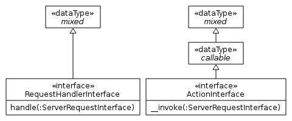

# HTTP Request Handler Meta Document

## Contents

- [Summary](#1-summary)
- [Why Bother?](#2-why-bother)
- [Scope](#3-scope)
- [Design Decisions](#4-design-decisions)
- [People](#5-people)
- [Votes](#6-votes)
- [Relevant Links](#7-relevant-links)

## 1. Summary

This document describes the reasons behind decisions of the HTTP Request Handler PSR.

## 2. Why Bother?

* TBD. Some notes:
  - "HTTP Request-Response Cycle"
  - ["Minimal HTTP middleware"](https://groups.google.com/forum/#!topic/php-fig/B3jtdJA7-6w) at PHP Framework Interoperability Group

Common contracts for that tasks will allow libraries to be decoupled from concrete frameworks and vice versa.

## 3. Scope

### 3.1. Goals

* Standardize the most common HTTP Request Handlers, which accept _PSR-7 ServerRequestInterface instances_ and return _PSR-7 ResponseInterface instances_.
* Standardize contracts based on best practices.

### 3.2. Non-Goals

* Standardize or favor any particular application architecture or assume its presence.
* Standardize asynchronous/client HTTP Message handling, because
  - there are not enough use cases known to the authors,
  - these strategies can be standardized by separate PSRs.

## 4. Design Decisions

It is possible to distinguish two common approaches to process HTTP Messages: the _procedural_ approach in which methods mutate the state of their operands and the _functional_ approach in which methods return the result without modifying their operands.

[PSR-7](http://www.php-fig.org/psr/psr-7/) HTTP Messages are [immutable objects](http://en.wikipedia.org/wiki/Immutable_object), which makes defining their augmentation by means of `callable` and/or `__invoke` interfaces the most natural choice.

### 4.1 Why not `callable`?

While it is possible to define contracts solely informal and/or by means of `callable`/`is_callable`, the PHP `interface` language feature provide several crucial benefits:

* It allows static source code analysis, which improves IDE and QA tool support.
* `instanceof` makes run-time type checking simple, fast and reliable.
* The contract is available through PHP comments.

### 4.2 Why `__invoke`?

The method name `__invoke` or any alternative name make no substantial difference for interface implementers, but for callers – interface implementers MUST implement the corresponding `interface` to comply with this PSR in any case.

If we think of the absence of type declarations as the type declaration using the (non-existing) `mixed` type, then the type hierarchy differences between `__invoke` and non-`__invoke` interfaces can be pictured as:

The `__invoke` hierarchy allows callers to choose a more accurate type declaration depending on their needs, may it be `ActionInterface`, `callable` or none at all (the `mixed` type-hint). If we chose a non-`__invoke` name and a caller wants to support `callable` too, then the caller must skip the `callable` type by removing the type declaration entirely. This is undesirable, because it hampers static source code analysis of the caller code.

Furthermore, current _higher-order functions_ like middlewares, routers, their dispatchers and many more become instantaneously compatible with an `__invoke` interface, which additionally makes `__invoke` superior to alternative method names.

## 5. People

### 5.1. Editor(s)

* [Michael Mayer](https://github.com/schnittstabil)

### 5.2. Sponsors

* Vacant (Coordinator)
* Vacant

### 5.3. Contributors

People who contributed in discussions, votes, by reviews or in other ways by alphabetical order:

* [Rasmus Schultz](https://github.com/mindplay-dk)
* TBD

## 6. Votes

* **Entrance Vote:** TBD
* **Acceptance Vote:** TBD

## 7. Relevant Links

* TBD
